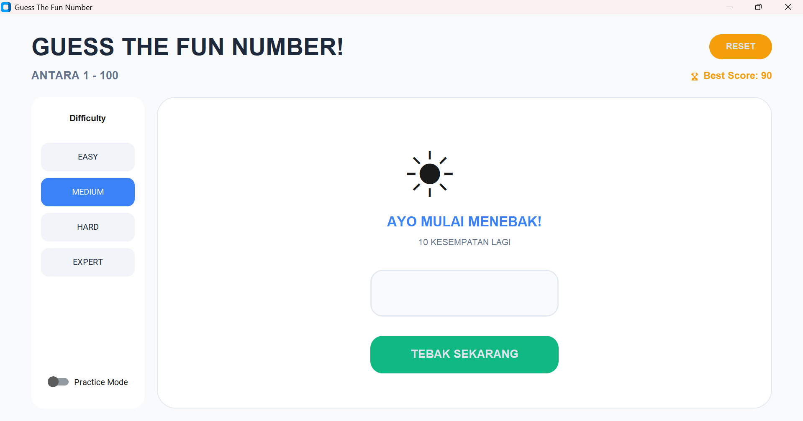

# Guess The Fun Number

A modern Number Guessing Game built with **Python & CustomTkinter**.

This project demonstrates clean architecture, UI/UX design, game logic separation, and persistent scoring.

## Features
- Multiple difficulty levels (Easy – Expert)
- Practice mode (unlimited guesses)
- Best score saved locally (JSON)
- Sound feedback (win / lose / hint)
- Modern UI with CustomTkinter
- Keyboard support (Enter to guess)

## Preview


## Tech Stack
- Python 3
- CustomTkinter
- Tkinter
- JSON (local storage)

## How to Run
```bash
pip install customtkinter
python number_guessing_game.py
